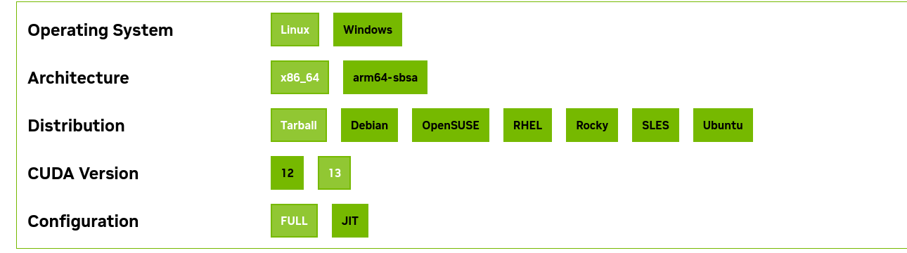

# Result of my research on embeded CPU and GPU performance


## Introduction
To compare the performance of embedded CPUs and GPUs, I conducted a benchmark test using matrix multiplication as a common computational task. The benchmark was performed differents platforms: 

 - x86_64 CPU: AMD Ryzen 7 7840HS
 - Laptop GPU: NVIDIA RTX 4060 Laptop
 - ARM64  CPU: Qualcomm Snapdragon 810 & Qualcomm Snapdragon 8 Gen 2
 - Phone  GPU: Adreno 430 & Adreno 740


## Prerequisites - All targets 

### 1. CMake
In order to compile the project you should install **CMake** ≥ 3.24 — [cmake.org/download](https://cmake.org/download)
```bash
  # Fedora
  sudo dnf install cmake
  # Ubuntu
  sudo apt install cmake
  # Check version
  cmake --version
```

## Prerequisites - Android targets

### 1. Android NDK
 
First, you need to download the [Android NDK](https://github.com/android/ndk/wiki) in your environment to cross-compile for Android targets.

You can use other versions of the Android NDK, but the project was built and successfully tested using **NDK r27d (27.3.13750724)**."

**Recommanded installation instructions:**
1. Download the [Android Command Line Tools](https://developer.android.com/studio#command-line-tools-only)
2. Install them and set `ANDROID_HOME` and `sdkmanager`to your bash path:
```bash
   # Put default Android Studio path 
   # or wherever you installed it
   echo 'export ANDROID_HOME=$HOME/Android/Sdk' >> ~/.bashrc  
   echo 'export PATH=$PATH:$ANDROID_HOME/cmdline-tools/latest/bin' >> ~/.bashrc
   source ~/.bashrc #reload bash configuration
```
3. Download your preferred version of the NDK using the `sdkmanager`:
```bash
sdkmanager --install "ndk;27.3.13750724"
```
<br>

### 2. Android Debug Bridge (ADB)

In addtion, if you want to push the binaries to your phone and execute them, you should install **ADB (Android Debug Bridge)**. 

```bash
# Ubuntu 
  sudo apt install android-tools-adb
# Fedora
  sudo dnf install android-tools
```
<br>

### 3. (BONUS) Androis Libs : libOpenCL.so, libclblast.a and libopenblas.a

To link to OpenCL correctly and avoid device-specific linking errors, you need an **OpenCL stub library** (`libOpenCL.so`). This allows the project to compile successfully, leaving the Android OS to dynamically load the real hardware driver at runtime.

In addtion, you need the **libclblast.a** and **libopenblas.a** static libraries to run the OpenCL-lib and OpenMP-lib benchmarks on your android device.

By default, these files are pre-compiled for **Android API 21** targeting **armeabi-v7a** and **arm64-v8a** using **Android NDK r27d**, and are included directly in the `/android/` directory of this project.

If you need to target a newer architecture (like ARMv9), You can use my custom toolchains to download, compile the stub, libraries and headers:
* **[clblast-android-toolchain](https://github.com/EmbeddedFrime/clblast-android-toolchain)** (Compiles both `libclblast.a` and the required `libOpenCL.so` stub)
* **[openblas-android-toolchain](https://github.com/EmbeddedFrime/openblas-android-toolchain)**

After compiling the libraries, replace the corresponding files in the android/ directory with the newly generated ones:

<pre>
android/
├── include/
│   ├── arm64-v8a/
│   │   ├── cblas.h <span style="color:red">*</span>
│   │   └── openblas_config.h <span style="color:red">*</span>
│   └── armeabi-v7a/
│       ├── cblas.h <span style="color:red">*</span>
│       └── openblas_config.h <span style="color:red">*</span>
└── libs/
    ├── arm64-v8a/
    │   ├── libOpenCL.so <span style="color:blue">*</span>
    │   ├── libclblast.a <span style="color:blue">*</span>
    │   └── libopenblas.a <span style="color:red">*</span>
    └── armeabi-v7a/
        ├── libOpenCL.so <span style="color:blue">*</span>
        ├── libopenblas.a <span style="color:blue">*</span>
        └── libopenblas.so <span style="color:red">*</span>

OpenBLAS toolchain  <span style="color:red">*</span> 
CLBlast toolchain <span style="color:blue">*</span>
</pre>

## Build instructions

To compile the project you just need to use this simple command deponding on your target platform:
```bash 
# --- Computer target --- 
#Generate raw build files 
cmake -B build
# compile all the frameworks
cmake --build build 
# e.g. Compile only the cpu target
cmake --build build --target cpu

# --- Android target ---
# e.g. android 21, NDK r27d, arm64-v8a
cmake -B build-android \
  -DCMAKE_TOOLCHAIN_FILE=$ANDROID_HOME/ndk/27.3.13750724/build/cmake/android.toolchain.cmake \
  -DANDROID_ABI=arm64-v8a \
  -DANDROID_PLATFORM=android-21

# compile all the frameworks
cmake --build build-android
# e.g. Compile only the cpu target
cmake --build build-android --target cpu

```

> **Deprecated Build Instructions**
>
> The Makefile-based build system is **deprecated** and is retained only for legacy compatibility.
> **Please use the CMake build system instead**, as it provides a cleaner, more maintainable, and cross-platform workflow.

<details>
<summary><strong>Legacy Makefile Build (Deprecated)</strong></summary>

### ⚠️ Legacy Makefile Workflow

Always clean the build artifacts before compiling a new architecture target configuration. Pass `DATATYPE` and `BLOCKSIZE` as environment overrides.

```bash
# Clean project workspace
make clean
```

### 1. Compile the code using the provided Makefile

#### PC / Laptop Build (Fedora Host)

```bash
# Compile individual backends
make cpu DATATYPE=FLOAT BLOCKSIZE=16
make openmp DATATYPE=FLOAT BLOCKSIZE=16
make opencl DATATYPE=FLOAT BLOCKSIZE=16
```

#### Android Cross-Compilation Build

```bash
# Compile all Android targets simultaneously (CPU, OpenMP, and OpenCL)
make all-android DATATYPE=FLOAT BLOCKSIZE=16
```

### 2. Execution Guide

All benchmarks accept size parameters via the `-s` flag and timing via `-t`.

#### PC / Laptop Build (Fedora Host)

```bash
# Native CPU Execution
./bin/matrix_multiplication_cpu_float_256 -s 1024 -t

# Native OpenMP Execution
./bin/matrix_multiplication_omp_float -s 1024 -t

# Native OpenCL Execution (NVIDIA RTX 4060)
./bin/matrix_multiplication_opencl_float_256 -s 1024 -t
```

#### Pushing and Running on Android Devices via ADB

```bash
# Push binaries to the device
adb push ./build-android/bin/* /data/local/tmp/

# Grant execution permissions
adb shell chmod 755 /data/local/tmp/*
```

Execute the benchmarks:

```bash
# Android CPU Execution
adb shell /data/local/tmp/matrix_mult_opencl -s 1024 -t

# Android OpenMP Execution
adb shell /data/local/tmp/matrix_android_openmp -s 1024 -t
adb shell /data/local/tmp/matrix_android_openmp_opt -s 1024 -t
adb shell /data/local/tmp/matrix_android_openmp_lib -s 1024 -t

# Android OpenCL Execution (QUALCOMM Adreno)
adb shell /data/local/tmp/matrix_android_opencl -s 1024 -t
adb shell /data/local/tmp/matrix_android_opencl_opt -s 1024 -t
adb shell /data/local/tmp/matrix_android_opencl_lib -s 1024 -t
```

</details>

### 3. Performance Metric Sheet

Below are the benchmarking metrics recorded for a matrix size of 1024 × 1024 (-s 1024) with a block size configuration of 16 (BLOCKSIZE=16).

| Environment / Platform | Compute Backend | Target Device | Host -> Device Copy | Kernel Execution Time | Device -> Host Copy | Total Elapsed Time |
| :--- | :--- | :--- | :--- | :--- | :--- | :--- |
| **Fedora Laptop** | Single-Thread CPU | Generic Device | 0.0000 ms | 6958.0000 ms | 0.0000 ms | 6958.0000 ms |
| **Fedora Laptop** | Multi-Thread OpenMP | Generic Device | 0.0000 ms | 604.5398 ms | 0.0000 ms | 604.5398 ms |
| **Fedora Laptop** | Heterogeneous OpenCL | NVIDIA RTX 4060 Laptop | 0.6914 ms | 11.5353 ms | 0.3446 ms | 12.5713 ms |
| | | | | | | |
| **Android Mobile** | Single-Thread CPU | Generic Device | 0.0000 ms | 25455.0000 ms | 0.0000 ms | 25455.0000 ms |
| **Android Mobile** | Multi-Thread OpenMP | Generic Device | 0.0000 ms | 11063.5859 ms | 0.0000 ms | 11063.5859 ms |
| **Android Mobile** | Heterogeneous OpenCL | QUALCOMM Adreno GPU | 0.3150 ms | 1353.3130 ms | 14.3440 ms | 1367.9720 ms |


atlas and openblast 

try 32 bits and 64 bits

The objectives is to translate all the benchmarks to the same code and then compare the performance of the different languages and libraries on the same hardware.


```bash
# 1. Clean the old binaries
make clean

# 2. Compile the library with debugging symbols (-g)
g++ -DFLOAT -DOPENCL -g -c ./opencl/lib_opencl_lib.cpp -o ./opencl/lib_opencl_lib.o -I/usr/local/cuda/include/ -lclblast

# 3. Compile the main harness with debugging symbols (-g) AND turn off optimizations (-O0)
g++ -DFLOAT -DOPENCL -g -O0 main.cpp ./opencl/lib_opencl_lib.o ./cpu_functions/cpu_functions.cpp -o ./bin/matrix_multiplication_opencl_lib_float -I/usr/local/cuda/include/ -lOpenCL -lclblast

# launch gdb
gdb --args ./bin/matrix_multiplication_opencl_lib_float -s 1024 -t


(gdb) r
(gdb) bt
```


How to install cblas : 
https://www.openmathlib.org/OpenBLAS/docs/install/#__tabbed_1_3


how to install  CLBBlast : 
https://github.com/CNugteren/CLBlast/blob/master/doc/installation.md


### 1. CMake Build for Android
```
cmake -B build-android \
  -DCMAKE_TOOLCHAIN_FILE=$ANDROID_HOME/ndk/27.3.13750724/build/cmake/android.toolchain.cmake \
  -DANDROID_ABI=arm64-v8a \
  -DANDROID_PLATFORM=android-21
  ```

### 2. Compile your target
```
cmake --build build-android --target android_matrix_mult_cpu
```


### 1. CMake Build for Android
```
cmake -B build-android \
  -DCMAKE_TOOLCHAIN_FILE=$ANDROID_HOME/ndk/27.3.13750724/build/cmake/android.toolchain.cmake \
  -DANDROID_ABI=arm64-v8a \
  -DANDROID_PLATFORM=android-21

cmake --build build-android --target cpu
cmake --build build-android --target openmp openmp-opt cl opencl-opt
```


### 2. Push it to your phone and run it
```
adb push ./build-android/bin/* /data/local/tmp/
adb shell chmod 755 /data/local/tmp/*
adb shell /data/local/tmp/matrix_mult_opencl -s 1024 -t -v
./data/local/tmp/
```

i=1; while [ "$i" -le 100 ]; do ./data/local/tmp/matrix_mult_opencl_opt -s 512 -c >> /data/local/tmp/results_512.csv; i=$((i + 1)); done; echo "Done!"

### 1. CMake Build for computer
```
cmake -B build

cmake --build build --target cpu
```

### 2. execute it on your computer
```
./build/bin/matrix_mult_cpu -s 1024 -t
```


speak about all the parameter you can change in the benchmark and how to change them, like the size of the matrix, the block size, the data type, the number of threads, etc.

EXPORT ... 


for some benchmark you will need to install cudnn the link : https://developer.nvidia.com/cudnn-downloads



for b in ./build/bin/*; do if [ -x "$b" ]; then name="${b##*/}"; echo -e "\n=== Running $name ==="; "$b" -s 2048  -t ; fi; done


adb shell 'for b in /data/local/tmp/convolution*; do [ -x "$b" ] || continue; name="${b##*/}"; echo "\n=== Running $name ==="; "$b" -s 2048 -t -v; done'

cmake -B build-float-256 -DDATATYPE=FLOAT -DBLOCKSIZE=256
cmake -B build-double-128 -DDATATYPE=DOUBLE -DBLOCKSIZE=128


## 1. OpenCL & OpenCL-Related Libraries

* **`OpenCL::OpenCL` (desktop) / `libOpenCL.so` (Android)**
  * The core OpenCL runtime library used for the OpenCL versions of the benchmarks.
* **`clblast`**
  * An optimized OpenCL BLAS (Basic Linear Algebra Subprograms) library, used for accelerated matrix operations.
* **`vkFFT` (included as headers via `findVkFFT`)**
  * A high-performance GPU FFT library supporting Vulkan, CUDA, OpenCL, and HIP backends.

---

## 2. CUDA & NVIDIA Libraries

* **`CUDA::cudart`**
  * CUDA Runtime library.
* **`CUDA::cuda_driver`**
  * CUDA Driver API library.
* **`CUDA::cublas`**
  * NVIDIA's GPU-accelerated Linear Algebra library.
* **`CUDA::cufft`**
  * NVIDIA's GPU-accelerated Fast Fourier Transform library.
* **`cudnn`**
  * NVIDIA's CUDA Deep Neural Network library, used for deep learning operations like pooling and activation layers.

---

## 3. HIP / AMD ROCm Libraries

* **`hip::host`**
  * AMD's HIP library target used to run CUDA-like code on AMD hardware.

---

## 4. CPU, Math & Threading Libraries

* **`OpenMP::OpenMP_CXX` (desktop) / `-static-openmp` (Android link flag)**
  * Used for CPU multi-threading parallelism.
* **`BLAS::BLAS`**
  * Standard Basic Linear Algebra Subprograms for CPU mathematical operations (resolves to CPU BLAS libraries like OpenBLAS).
* **`fftw3` (desktop) / `libfftw3.a` (Android)**
  * Fast Fourier Transform library on the CPU, used as a reference benchmark.


## To do list:
- [X] fix issue of correctness between cpu and gpu in some benchmark
- [ ] Check for cl error dunring memory copy to host and clean
- [ ] Big cmake to compile everything 
- [ ] Tuto to install every deps(HIP,CUDA,OpenMP,OpenBLAS,CLBlast,FFTW3,OpenCL,CUDNN...)
- [ ] Tuto how to use the benchmark(param etc) + compile with cmake
- [ ] fix of the clock to be executed in runtime
- [ ] add UMA implementation for Android
- [ ] be compatible with jetson board
- [ ] add UMA for jetson board
- [ ] create a test with vulkan for android to have best perfomance


